# Hi, I'm Nils 👋

Principal QA Engineer focused on cloud-native quality engineering, test automation, and open source.

I love building and maintaining practical tooling for Robot Framework users working with Kubernetes and Infrastructure as Code.

## What I Work On 🧪

- 🤖 [Robot Framework](https://robotframework.org/) based testing for Kubernetes and cloud-native platforms
- ✅ QA strategy for modern distributed systems
- ☁️ [CNCF](https://www.cncf.io/) ecosystem projects and workflows
- 🏗️ Infrastructure testing with [OpenTofu](https://opentofu.org/) and Terraform

## Open Source Contributions 🌍

### Maintainer: KubeLibrary 🧰

[Robotframework-KubeLibrary](https://github.com/devopsspiral/KubeLibrary/)  
Maintainer and active contributor. I have invested heavily in making Kubernetes testing with Robot Framework more reliable and accessible for QA teams.   

### Creator + Maintainer: TerraformLibrary 🛠️

[Robotframework-TerraformLibrary](https://github.com/Nilsty/robotframework-terraformlibrary)  
Built and maintain a Robot Framework library to support Infrastructure as Code testing workflows for teams using Terraform/OpenTofu.  

## Talks and Community 🎤

I regularly share practical QA and automation lessons with the Robot Framework community.

- 📍 RoboCon Helsinki 2021: [YouTube talk](https://www.youtube.com/watch?v=0vtj9Hg-LWU)
- 📍 RoboCon Helsinki 2025: [YouTube talk](https://www.youtube.com/watch?v=q1iLttgY8I0)

In 2024, I also delivered a full-day RoboCon workshop for QA engineers on Kubernetes and cloud-native application testing 🚀

## More Community Highlights ✨

Speaking, publications, and community timeline

- 2025: Speaker at RoboCon Helsinki - [Infrastructure as code - Yet another super power for your test automation](https://www.youtube.com/watch?v=q1iLttgY8I0)
- 2024: Speaker at CIVO Navigate Europe - [Why Adding Backstage Alone Won't Transform Your Development Platform!](https://www.youtube.com/watch?v=C6KfoOBP98U)
- 2024: Full-day RoboCon workshop - [Kubernetes and cloud native application testing for QA engineers](https://github.com/Nilsty/kube-your-robots)
- 2023: Talk at PlatformCon - [Testing platforms](https://www.youtube.com/watch?v=LFOEYGLyHL4)
- 2023: Became co-organizer of [Berlin DevOps Meetup (4000+ members)](https://www.meetup.com/blndevops/)
- 2022: Talk at PlatformCon - [Platform as code: code scaffolding in dynamic environments](https://www.youtube.com/watch?v=17aQvmRcrJc)
- 2021: Speaker at RoboCon - [How Kubernetes brings QA and DevOps closer together](https://www.youtube.com/watch?v=0vtj9Hg-LWU)
- 2020: Published article - [KubeLibrary: Testing Kubernetes with RobotFramework](https://medium.com/humanitec-developers/kubelibrary-6644ca06cea4)
- 2020: Talk at Selenium Meetup - [Extending Robot Framework with custom keywords](https://www.youtube.com/watch?v=QU_-KGLzK3c)
- 2020: Published article - [Robot Framework: The Key to Improve Testing](https://medium.com/humanitec-developers/robot-framework-the-key-to-improve-testing-70f2eaeda981)
- 2019: Published article - [Testing in Microservice Architectures](https://medium.com/humanitec-developers/testing-in-microservice-architectures-b302f584f98c)
- 2019: Talk at RoboCon - [Turning Test Results into Big Data](https://www.youtube.com/watch?v=fb42449bdz0)
- 2018: Selenium Meetup at Zalando Lounge - QA goes monitoring with Elastic Stack
- 2017: Built [seeny (open source)](https://github.com/Gardosen/seeny) for maintainable Selenium-based UI automation

## GitHub Stats 📊

